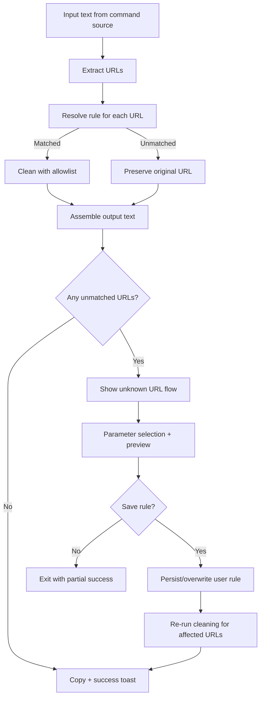

# feat: Add user-defined rules for unsupported URLs

## Overview

Introduce local user-defined cleaning rules that apply by `host + path`, add an in-flow rule creation experience when unknown URLs are found, preserve partial success in batch cleaning, and provide a dedicated rule management command for CRUD operations.

## Problem Frame

Current cleaning behavior depends on built-in rules only, so unsupported URLs force users into repetitive manual cleanup and one-off decisions (see origin: `docs/brainstorms/user-defined-rules-for-unsupported-urls-requirements.md`). This plan adds a persistent user rule layer and a clear unknown-URL handling flow that avoids destructive defaults.

## Requirements Trace

- R1. Unknown URL detection surfaces a clear "no available rule" state and avoids silent full-parameter stripping.
- R2. Users can choose parameters to keep and preview result in the same flow.
- R3. Users can save that selection as a rule and reuse it for later matching URLs.
- R4. Matching key is `host + path`.
- R5. Rule priority is user > built-in, then longer path, then latest update.
- R6. Built-in behavior remains unchanged unless overridden by a higher-priority user rule.
- R7. A dedicated rule management entry exists.
- R8. Rule management shows target (`host + path`) and allowlist.
- R9. Edit/delete take effect on next clean operation.
- R10. Multi-URL text remains partially successful; unsupported URLs are preserved and surfaced.
- R11. Custom rules persist locally across Raycast restarts.
- R12. Saving a rule for existing `host + path` overwrites and activates immediately.

## Scope Boundaries

- No auto-guessing of "best" parameters.
- No cross-device/account sync.
- No wildcard DSL or advanced expression engine.

### Deferred to Separate Tasks

- Migration/import-export for user rule backup.
- Advanced conflict tooling (history diff, rollback).

## Context & Research

### Relevant Code and Patterns

- Current cleaning pipeline and result copy/toast flow: `src/utils/remove-tracking-params.ts`.
- URL extraction/replacement/query filtering helpers: `src/utils/url-utils.ts`.
- Existing command entry points by source (selected text/clipboard): `src/clean-selected-text.ts`, `src/clean-clipboard-text.ts`.
- Existing static rule shape and allowlist behavior: `src/utils/rules.ts`.

### Institutional Learnings

- No `docs/solutions/` entries exist in this repository yet.

### External References

- Raycast Storage API (local encrypted extension storage shared across commands): https://developers.raycast.com/api-reference/storage
- Raycast Form API (interactive selection and submit flows): https://developers.raycast.com/api-reference/user-interface/form
- Raycast no-view lifecycle constraints (no-view exports async function; interactive flow requires view command): https://developers.raycast.com/information/lifecycle

## Key Technical Decisions

- Use `LocalStorage` as the source of truth for user rules to satisfy R11 without external dependencies.
- Normalize match keys as `normalizedHost + normalizedPath`, where host is lowercase and path keeps case but trims trailing slash (except `/`) to reduce accidental duplicates.
- Resolve matching conflicts with deterministic scoring:
  - layer priority: user > built-in
  - specificity: longer normalized path first
  - recency: latest `updatedAt` wins
- Represent built-in and user rules with one unified runtime model, so the cleaning pipeline has one resolver and preserves R6 behavior by default.
- Convert cleaning commands from `no-view` to `view` so unknown URLs can stay in the same user flow for parameter selection + preview + save (R2, R3).
- Preserve batch behavior by applying known rules immediately and leaving unknown URLs untouched while surfacing one consolidated warning/action context (R10).

## Open Questions

### Resolved During Planning

- Interaction carrier for R2/R7: use Raycast `view` commands with `Form`/`List` UX instead of `no-view` commands.
- `host + path` normalization details:
  - host: lowercase
  - path: use parsed `pathname`, collapse trailing slash except root
  - ignore query/hash for rule keys
  - parsing failure: keep URL unchanged and report as unsupported

### Deferred to Implementation

- Whether parameter selection UX should be checkbox list or multiselect dropdown in the first iteration (either is acceptable if preview + save are preserved).
- Whether rule editing should use inline form navigation or separate create/edit views for maintainability.

## High-Level Technical Design

> _This illustrates the intended approach and is directional guidance for review, not implementation specification. The implementing agent should treat it as context, not code to reproduce._

## Implementation Units

- [x] **Unit 1: Establish automated test foundation for new rule system**

**Goal:** Add lightweight test tooling so new matcher/storage/UI logic can be validated continuously.

**Requirements:** Supports verification of R1-R12

**Dependencies:** None

**Files:**

- Modify: `package.json`
- Modify: `tsconfig.json`
- Create: `vitest.config.ts`
- Create: `src/test/setup.ts`
- Test: `src/utils/__tests__/smoke.test.ts`

**Approach:**

- Introduce a minimal test runner setup aligned with existing TypeScript config.
- Add one smoke test to validate command-side utilities can be imported in test runtime.
- Keep this setup intentionally small; expand only as needed by subsequent units.

**Patterns to follow:**

- Existing TypeScript strictness in `tsconfig.json`.

**Test scenarios:**

- Happy path: test command runs and executes a basic utility assertion.
- Error path: invalid test setup fails fast with clear error output.

**Verification:**

- Repository can execute automated tests for utility and component behavior added in later units.

- [x] **Unit 2: Introduce unified rule model and user-rule storage**

**Goal:** Add a persistent user rule repository and shared rule types that can merge built-in and user-defined rules.

**Requirements:** R3, R4, R5, R11, R12

**Dependencies:** Unit 1

**Files:**

- Create: `src/types/rule.ts`
- Create: `src/utils/user-rules-storage.ts`
- Modify: `src/utils/rules.ts`
- Test: `src/utils/__tests__/user-rules-storage.test.ts`

**Approach:**

- Define `RuleSource` (`builtin`/`user`) and `MatchTarget` (`host`, `path`, `key`) types.
- Add serialization helpers for `LocalStorage` read/write and default empty state.
- Include `updatedAt` in user rules for tie-breaking and overwrite semantics.
- Expose repository operations: list, upsert-by-key, delete-by-key.

**Patterns to follow:**

- Stateless utility composition in `src/utils/url-utils.ts`.
- Minimal command-facing side effects pattern in `src/utils/remove-tracking-params.ts`.

**Test scenarios:**

- Happy path: `upsert` on new key persists one rule and returns it on next load.
- Happy path: `upsert` on existing key overwrites allowlist and updates timestamp.
- Edge case: empty storage returns empty array without throwing.
- Error path: malformed stored JSON falls back to empty state and does not crash command flow.

**Verification:**

- Rule repository can persist, load, overwrite, and delete user rules deterministically.

- [x] **Unit 3: Build normalized matching and priority resolver**

**Goal:** Resolve one effective rule per URL using required normalization and priority semantics.

**Requirements:** R4, R5, R6

**Dependencies:** Unit 2

**Files:**

- Create: `src/utils/rule-matcher.ts`
- Modify: `src/utils/url-utils.ts`
- Modify: `src/utils/remove-tracking-params.ts`
- Test: `src/utils/__tests__/rule-matcher.test.ts`

**Approach:**

- Add URL key normalization helper for `host + path`.
- Build candidate selection across built-in and user rules.
- Implement stable comparator for source priority, path length, and recency.
- Return structured match result (`matchedRule`, `reason`, `normalizedTarget`) for downstream UX messaging.

**Execution note:** Implement matcher unit tests first to lock priority semantics before integration.

**Patterns to follow:**

- Existing query filtering behavior in `src/utils/url-utils.ts`.

**Test scenarios:**

- Happy path: user rule and built-in both match same key; user rule wins.
- Happy path: same source rules with overlapping paths; longer normalized path wins.
- Happy path: same key and same source; newer `updatedAt` wins.
- Edge case: trailing slash variants map to same key (`/item` == `/item/`).
- Edge case: root path remains `/` and does not collapse to empty.
- Error path: invalid URL input yields no match and unsupported reason without throw.

**Verification:**

- Resolver returns one deterministic rule (or explicit no-match) for repeated identical input.

- [x] **Unit 4: Refactor cleaning pipeline for partial-success metadata**

**Goal:** Produce cleaned output plus unmatched URL metadata so commands can offer in-flow recovery.

**Requirements:** R1, R10

**Dependencies:** Unit 3

**Files:**

- Modify: `src/utils/remove-tracking-params.ts`
- Modify: `src/clean-clipboard-text.ts`
- Modify: `src/clean-selected-text.ts`
- Test: `src/utils/__tests__/remove-tracking-params.test.ts`

**Approach:**

- Separate pure cleaning transform from command UI side effects.
- Return `cleanedText`, `matchedCount`, `unmatchedUrls[]`, and per-URL match diagnostics.
- Keep unmatched URLs unchanged in output text.
- Change success messaging to distinguish "all cleaned" vs "partially cleaned, rules available to add".

**Patterns to follow:**

- Current `findURLs` + `replaceURLs` transformation pattern in `src/utils/url-utils.ts`.

**Test scenarios:**

- Happy path: all URLs matched -> all transformed according to allowlists.
- Happy path: mixed matched/unmatched URLs -> matched cleaned, unmatched untouched.
- Edge case: text without URLs returns original text and empty diagnostics.
- Integration: multi-URL replacement preserves URL order mapping and does not cross-replace duplicates incorrectly.

**Verification:**

- Commands can consume one structured result object and branch UX based on unmatched URLs.

- [x] **Unit 5: Add in-flow unknown URL rule creation and preview UX**

**Goal:** Let users select keep-params, preview cleaned URL, and save/overwrite user rule in the same command flow.

**Requirements:** R1, R2, R3, R12

**Dependencies:** Unit 4

**Files:**

- Modify: `package.json`
- Create: `src/clean-clipboard-text-view.tsx`
- Create: `src/clean-selected-text-view.tsx`
- Create: `src/components/unknown-url-rule-form.tsx`
- Modify: `src/clean-clipboard-text.ts`
- Modify: `src/clean-selected-text.ts`
- Test: `src/components/__tests__/unknown-url-rule-form.test.tsx`

**Approach:**

- Switch user-facing commands to `view` mode and drive a small state machine: loading input -> clean attempt -> unknown handling form (if needed) -> preview/save -> finalize copy/toast.
- For each unmatched URL, parse available query parameter keys and allow user selection.
- Show immediate preview for the active unmatched URL and final merged text preview before submit.
- On save, upsert by normalized `host + path`, re-run cleaning for affected URLs, then finish.
- If user skips save, keep unmatched URLs untouched and complete with partial-success message.

**Execution note:** Add behavior tests for form transitions before connecting command entry points.

**Patterns to follow:**

- Existing clipboard/selected source split from `src/clean-clipboard-text.ts` and `src/clean-selected-text.ts`.
- Raycast Form submit pattern (actions + controlled state).

**Test scenarios:**

- Happy path: unmatched URL with params -> select subset -> preview updates -> save -> output uses saved allowlist.
- Happy path: same key saved again -> previous rule overwritten and new result applied immediately.
- Edge case: unmatched URL with no query params -> show no-params state and skip save option.
- Edge case: parseable URL but duplicate query keys -> UI deduplicates selectable key list.
- Error path: storage write fails -> show failure toast and keep partial cleaned output unchanged.
- Integration: one text with supported + unsupported URLs completes without global failure.

**Verification:**

- First encounter with unknown URL can be resolved and persisted without leaving command flow.

- [x] **Unit 6: Add dedicated rule management command (CRUD)**

**Goal:** Provide standalone rule management entry for inspect/edit/delete operations.

**Requirements:** R7, R8, R9, R11, R12

**Dependencies:** Unit 2

**Files:**

- Modify: `package.json`
- Create: `src/manage-user-rules.tsx`
- Create: `src/components/rule-editor-form.tsx`
- Test: `src/components/__tests__/rule-editor-form.test.tsx`
- Test: `src/__tests__/manage-user-rules.test.tsx`

**Approach:**

- Add a new Raycast command entry that lists user rules.
- Show each row as `host + path` with parameter allowlist detail.
- Provide actions for create, edit, delete; edit/delete execute against `LocalStorage` and refresh list state.
- Apply updates immediately so subsequent cleaning calls read latest rules.

**Patterns to follow:**

- Existing command module boundaries in `src/*.ts`.

**Test scenarios:**

- Happy path: create a rule from manager appears in list and affects next clean operation.
- Happy path: edit existing allowlist updates details and match behavior immediately.
- Happy path: delete removes rule and built-in behavior applies on next clean where applicable.
- Edge case: empty rules list renders clear empty-state guidance.
- Error path: delete on missing key is treated as idempotent success.
- Integration: save in unknown-flow and edit in manager operate on the same underlying storage record.

**Verification:**

- Rule list reflects persistent storage state and changes propagate to cleaner without restart.

## System-Wide Impact

- **Interaction graph:** Command entry points call a shared cleaning core and shared user-rule repository; unknown URL flow and manager command both mutate the same storage.
- **Error propagation:** URL parse and storage failures surface as user-facing partial/failure toasts while preserving non-failing cleaned output.
- **State lifecycle risks:** Overwrite semantics require strict key normalization to avoid duplicate logical records.
- **API surface parity:** Both clipboard and selected-text commands must keep equivalent behavior to avoid mode drift.
- **Integration coverage:** Cross-command scenario (save in one command, consume in another) must be covered.
- **Unchanged invariants:** Built-in rule behavior stays unchanged unless a higher-priority user rule matches the same URL target.

## Risks & Dependencies

| Risk                                                      | Mitigation                                                                         |
| --------------------------------------------------------- | ---------------------------------------------------------------------------------- |
| View-command migration regresses quick no-view experience | Keep loading-first UX and preserve one-action completion when all URLs are matched |
| Normalization mistakes create duplicate or missed matches | Centralize key builder utility and lock behavior with matcher tests                |
| Rule overwrite semantics are confusing                    | Explicit copy in save action: "Save and overwrite existing rule for this target"   |
| Missing UI tests slows regression detection               | Add focused component/state tests around unknown-flow and manager CRUD             |

## Documentation / Operational Notes

- Update command descriptions in `package.json` to explain interactive fallback for unknown URLs.
- Add a short "User Rules" section to project documentation in a follow-up doc update once UI lands.

## Sources & References

- **Origin document:** `docs/brainstorms/user-defined-rules-for-unsupported-urls-requirements.md`
- Related code: `src/utils/remove-tracking-params.ts`
- Related code: `src/utils/url-utils.ts`
- External docs: https://developers.raycast.com/api-reference/storage
- External docs: https://developers.raycast.com/api-reference/user-interface/form
- External docs: https://developers.raycast.com/information/lifecycle
